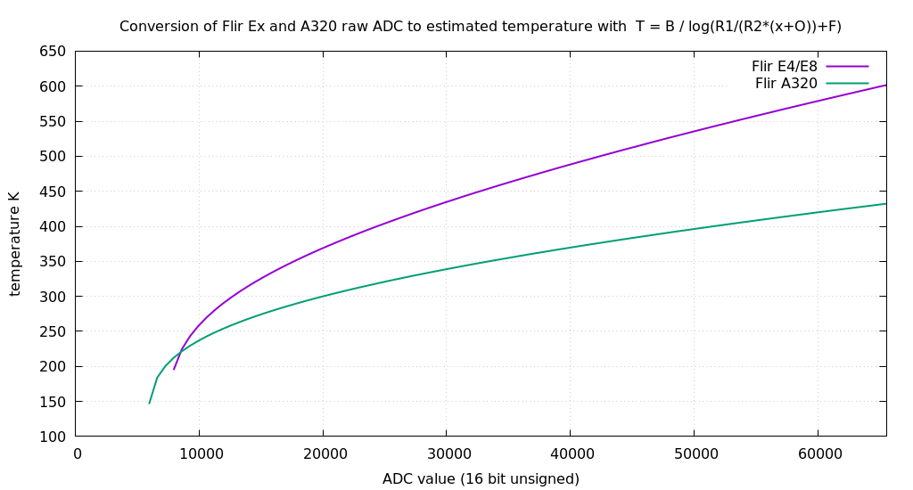

# flir_tools

Tools to convert raw radiometric image from Flir Ex (E4, E8 etc) and Flir 
A320 cameras into estimated tempartures without use of proprietary software.

This tool makes use of exiftool to extract radiometic data
and constants from the camera file and then using formulas discussed
at http://u88.n24.queensu.ca/exiftool/forum/index.php/topic,4898.msg23944.html#msg23944
produces an estimated temperate image.

The conversion formula used is: 

```
T = B / ln(R1/(R2(S+O))+1)
```

Where S is the raw ADC value from the camera file and
R1, R2, B, F, O are constants obtained using 
exiftool

The ADC to temperature curve looks like this (using set of
constants obtained from a Flir Ex and a Flir A320.



## TODO

 * what about emissivity?
 


