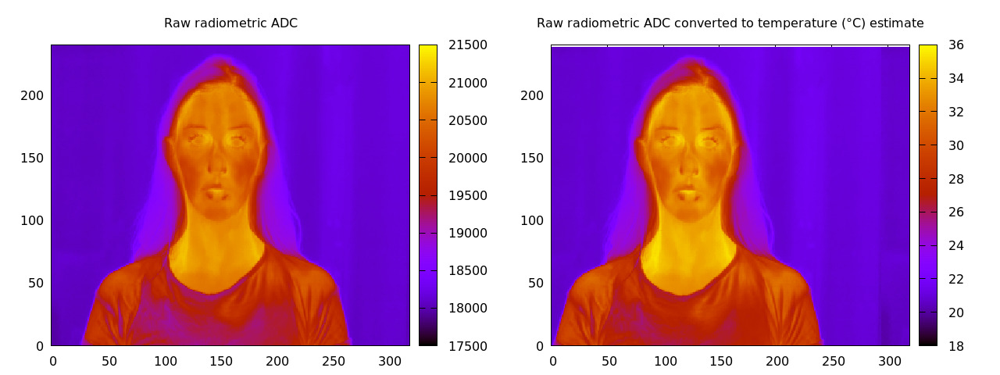

# FLIR tools

Tools to convert raw radiometric image from Flir Ex (E4, E8 etc) and Flir 
A320 cameras into estimated tempartures without use of proprietary software.
It should work with other Flir cameras (and possibly other brands).

This tool makes use of exiftool to extract radiometic data
and constants from the camera file and then using formulas discussed
at http://u88.n24.queensu.ca/exiftool/forum/index.php/topic,4898.msg23944.html#msg23944
produces an estimated temperate image.

The conversion formula is: 

```
T = B / ln(R1/(R2(S+O))+F)
```

Where S is the raw ADC value from the camera file and
R1, R2, B, F, O are constants obtained using 
exiftool

The ADC to temperature curve looks like this (using 
constants obtained from a Flir Ex and a Flir A320):




## Using flir2temp tool

Script flir2temp.sh will take a .SEQ or .JPG camera file from a Flir device and output 
16 bit PGM gray scale image where the value is C or K. The script uses exiftool
to extract the radiometric raw data and the camera constants. Then a C program
implements the formula above to arrive at a temperature image.

Example

```
flir2temp.sh myimage.seq
```

will generate file myimage.pgm

The PGM file can be viewed with a 16 bit channel capable image viewer such as
ImageJ.

  
## TODO

 * this needs to be validated experimentally
 * output TIFF files
 * what about emissivity?
 


